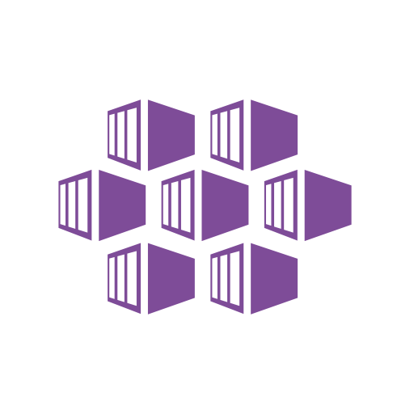

# training 

## Webapps  
- [Lab 1 - Build and deploy image to registry ](webapps/Registry.md)
- [Lab 2 - Deploy and run containers in Azure Webapps ](webapps/webappdeploy.md)
- [Lab 3 - Perform A B testing and deployments using slots  ](webapps/deploymentslots.md)

## AKS
 - Create AKS Cluster 
 - Deploy Appliction and expose it 
 - Enable monitoring 

- [Lab 2 - AKS ](aks/README.md)
