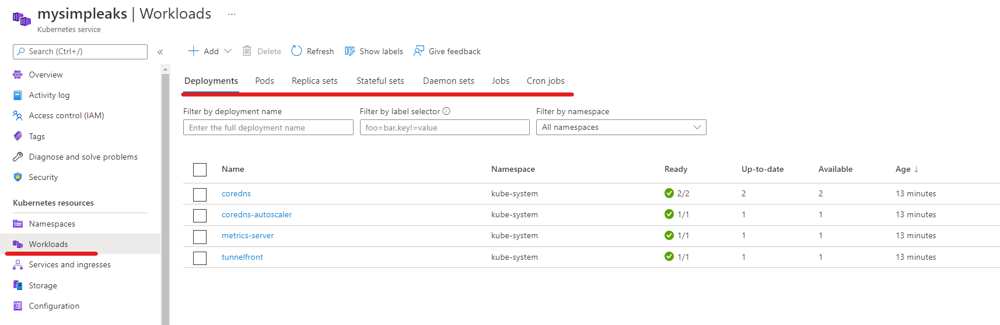
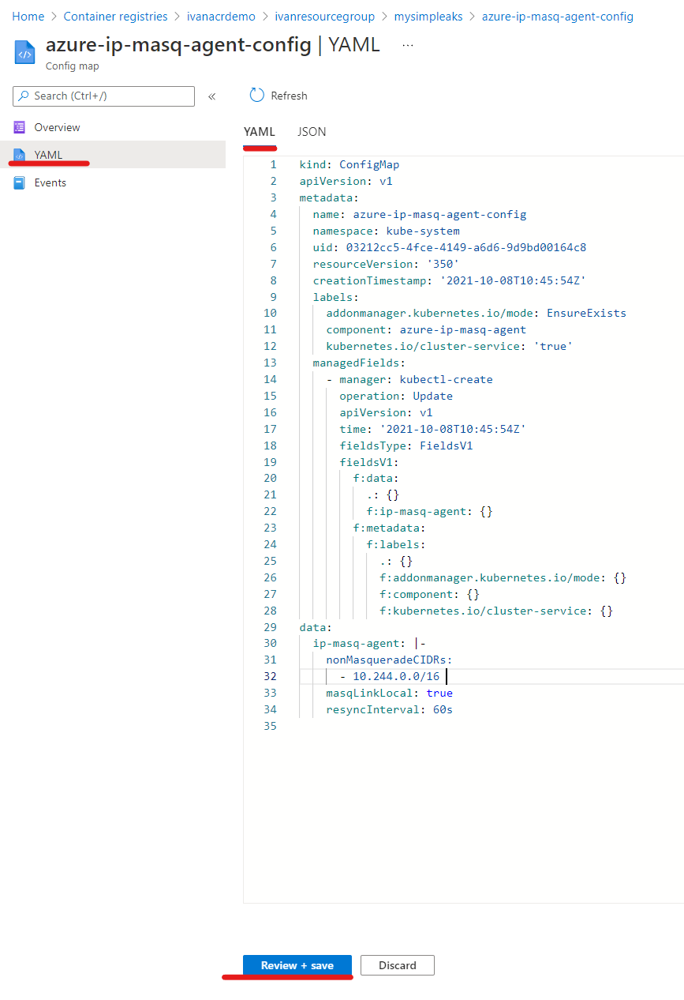

# Create and Access AKS 
In this exercise  we will create a Kubernetes cluster that can autoscale and is configured to pull images  automatically from our registry . To achieve this so we will:

- Use the Azure CLI
- Configure your local access credentials to control your cluster using kubectl
- Take some first steps
- Run our first pod
## Create the cluster
- Create resoruce group for cluster 
```
az group create --location westeurope --name $resourceGroup 
```
- Create AKS: The following script creates an AKS with the following configuration 

| Parameter  | Description |
| ------------- | ------------- |
|--resource-group  |  The resource group where the AKS cluster will be created  |
| --nodepool-name  |   Name of the nodepool where our apps will run   |
| --attach-acr |  The resourceid or name of the ACR registry. This is the name of the registry in the Registry overview page. Alternatively you can execute the following command   ``az acr show  --name ivanacrdemo  --query id`` |
| Registry name | Enter a unique name and make a note of it for later.|
| --min-count |  The min number of nodes that will run when using cluster-autoscaler. When the cluster down scales it will not go below this value |
| --max-count | The max numebr of nodes that the cluster auto scaler will scale to |
| --zones 3 | Spread the node pool vms across multiple zones for resilency. Can be 1,2,3. This indicates how many zones it should be spread across |
|  --enable-cluster-autoscaler | Enabled cluster auto scaler |
|  --kubernetes-version | The version of kubernetes to deploy |

- Set variables 
```
## Set Variables 
RESOURCE_GROUP="ivanresourcegroup"
AKS_CLUSTER="mysimpleaks"
ACR_REGISTRY="ivanacrdemo"
```
- Create Cluster  
```
## Create Cluster 
az aks create \
 --resource-group $RESOURCE_GROUP \
 --node-vm-size=Standard_D2s_v3 \
 --kubernetes-version=1.20.9 \
 --name $AKS_CLUSTER \
 --nodepool-name="apppool" \
 --enable-cluster-autoscaler \
 --min-count 1 \
 --max-count 2 \
 --zones 3 \
 --attach-acr $ACR_REGISTRY \
 --node-count 1 \
 --generate-ssh-keys
```
- Output
```
 ivan@Azure:~$ az aks create \
>  --resource-group $RESOURCE_GROUP \
>  --node-vm-size=Standard_D2s_v3 \
>  --kubernetes-version=1.20.9 \
>  --name $AKS_CLUSTER \
>  --nodepool-name="apppool" \
>  --enable-cluster-autoscaler \
>  --min-count 1 \
>  --max-count 2 \
>  --zones 3 \
>  --attach-acr $ACR_REGISTRY \
>  --node-count 1 \
>  --generate-ssh-keys
AAD role propagation done[############################################]  100.0000%{
  "aadProfile": null,
  "addonProfiles": null,
  "agentPoolProfiles": [
    {
      "availabilityZones": [
        "3"
      ],
      "count": 1,
      "enableAutoScaling": true,
      "enableEncryptionAtHost": false,
      "enableFips": false,
      "enableNodePublicIp": false,
      "enableUltraSsd": false,
      "gpuInstanceProfile": null,
      "kubeletConfig": null,
      "kubeletDiskType": "OS",
      "linuxOsConfig": null,
      "maxCount": 2,
      "maxPods": 110,
      "minCount": 1,
      "mode": "System",
      "name": "apppool",
      "nodeImageVersion": "AKSUbuntu-1804gen2containerd-2021.09.28",
      "nodeLabels": null,
      "nodePublicIpPrefixId": null,
      "nodeTaints": null,
      "orchestratorVersion": "1.20.9",
      "osDiskSizeGb": 128,
      "osDiskType": "Managed",
      "osSku": "Ubuntu",
      "osType": "Linux",
      "podSubnetId": null,
      "powerState": {
        "code": "Running"
      },
      "provisioningState": "Succeeded",
      "proximityPlacementGroupId": null,
      "scaleDownMode": null,
      "scaleSetEvictionPolicy": null,
      "scaleSetPriority": null,
      "spotMaxPrice": null,
      "tags": null,
      "type": "VirtualMachineScaleSets",
      "upgradeSettings": null,
      "vmSize": "Standard_D2s_v3",
      "vnetSubnetId": null
    }
  ],
  "apiServerAccessProfile": null,
  "autoScalerProfile": {
    "balanceSimilarNodeGroups": "false",
    "expander": "random",
    "maxEmptyBulkDelete": "10",
    "maxGracefulTerminationSec": "600",
    "maxNodeProvisionTime": "15m",
    "maxTotalUnreadyPercentage": "45",
    "newPodScaleUpDelay": "0s",
    "okTotalUnreadyCount": "3",
    "scaleDownDelayAfterAdd": "10m",
    "scaleDownDelayAfterDelete": "10s",
    "scaleDownDelayAfterFailure": "3m",
    "scaleDownUnneededTime": "10m",
    "scaleDownUnreadyTime": "20m",
    "scaleDownUtilizationThreshold": "0.5",
    "scanInterval": "10s",
    "skipNodesWithLocalStorage": "false",
    "skipNodesWithSystemPods": "true"
  },
  "autoUpgradeProfile": null,
  "azurePortalFqdn": "mysimpleak-ivanresourcegrou-420752-9a4fdf47.portal.hcp.westeurope.azmk8s.io",
  "disableLocalAccounts": null,
  "diskEncryptionSetId": null,
  "dnsPrefix": "mysimpleak-ivanresourcegrou-420752",
  "enablePodSecurityPolicy": null,
  "enableRbac": true,
  "extendedLocation": null,
  "fqdn": "mysimpleak-ivanresourcegrou-420752-9a4fdf47.hcp.westeurope.azmk8s.io",
  "fqdnSubdomain": null,
  "httpProxyConfig": null,
  "id": "/subscriptions/xxxx/resourcegroups/ivanresourcegroup/providers/Microsoft.ContainerService/managedClusters/mysimpleaks",
  "identity": {
    "principalId": "xxxx",
    "tenantId": "xxxx",
    "type": "SystemAssigned",
    "userAssignedIdentities": null
  },
  "identityProfile": {
    "kubeletidentity": {
      "clientId": "b0be0d34-1900-4a46-af2d-58cdf7ea6760",
      "objectId": "b8962aa9-402c-4aa1-9172-26c9ecbd7c02",
      "resourceId": "/subscriptions/4207529e-1711-48d4-bb4sssss/resourcegroups/MC_ivanresourcegroup_mysimpleaks_westeurope/providers/Microsoft.ManagedIdentity/userAssignedIdentities/mysimpleaks-agentpool"
    }
  },
  "kubernetesVersion": "1.20.9",
  "linuxProfile": {
    "adminUsername": "azureuser",
    "ssh": {
      "publicKeys": [
        {
          "keyData": "ssh-rsa AAAAB3NzaC1yc2EAAAADAQABAAABAQC2mrO2PzMafQ9hucBGhvlguvz/J46tLpD+TW0vSH2bvEuQXehpCUKX/dn9I3hin8+U8ybhSiTWV1fDpvguORYdA+VexxUPFyYr1L1ytdyGZKPKfWQ7BgsZd+VaOV++u0ieQ0nycL4PTt7d66oX5BwomioXKTC5iIyHUdqL5nmkLiJgLs98hmk8uHqVkzK9gO0+lrWBQc+GKi2WV+6mDm54VYhRSSllzo98MwrK8P5IsYCK9dtWxv6xzE67hc7DUFdOd0+Cqc1uqdLWj8bVzN61rlEGihNFRttKGWluK0Xz5WipVBqgxhC7H/yTWI8a6ZQhIqV2VZMDPwB7vqeb5ied7Xd"
        }
      ]
    }
  },
  "location": "westeurope",
  "maxAgentPools": 100,
  "name": "mysimpleaks",
  "networkProfile": {
    "dnsServiceIp": "10.0.0.10",
    "dockerBridgeCidr": "172.17.0.1/16",
    "loadBalancerProfile": {
      "allocatedOutboundPorts": null,
      "effectiveOutboundIPs": [
        {
          "id": "/subscriptions/4207529e-1711-48d4-bb4a-01836e073bbb/resourceGroups/MC_ivanresourcegroup_mysimpleaks_westeurope/providers/Microsoft.Network/publicIPAddresses/9acfcb09-ca2c-40e5-88ee-d428c3fddb23",
          "resourceGroup": "MC_ivanresourcegroup_mysimpleaks_westeurope"
        }
      ],
      "idleTimeoutInMinutes": null,
      "managedOutboundIPs": {
        "count": 1
      },
      "outboundIPs": null,
      "outboundIpPrefixes": null
    },
    "loadBalancerSku": "Standard",
    "natGatewayProfile": null,
    "networkMode": null,
    "networkPlugin": "kubenet",
    "networkPolicy": null,
    "outboundType": "loadBalancer",
    "podCidr": "10.244.0.0/16",
    "serviceCidr": "10.0.0.0/16"
  },
  "nodeResourceGroup": "MC_ivanresourcegroup_mysimpleaks_westeurope",
  "podIdentityProfile": null,
  "powerState": {
    "code": "Running"
  },
  "privateFqdn": null,
  "privateLinkResources": null,
  "provisioningState": "Succeeded",
  "resourceGroup": "ivanresourcegroup",
  "securityProfile": null,
  "servicePrincipalProfile": {
    "clientId": "msi",
    "secret": null
  },
  "sku": {
    "name": "Basic",
    "tier": "Free"
  },
  "tags": null,
  "type": "Microsoft.ContainerService/ManagedClusters",
  "windowsProfile": null
} 
```
 - The above output shows the cluster is up and running 
## Browse AKS Resources  
The az aks create command created a second resource group named MC_adc-aks-rg_adc-cluster_westeurope containing all resources provisioned for our AKS cluster: The resources are implementation detail behind the cluster. The resources created under this resource groups should not be tocuhed and instead these will be managed by the AKS service. 

To view various details an status of the AKS cluster you can navigate to the cluster resource by either searching for AKS in the search bar or navigating to the resource group 

- Navigate to AKS resouce in the portal. 
- To view deployment details navigate workloads. Here you can see the various containers and deployments which are currently running in AKS. Additonaly namespaces, pods and configurations can be viewed here 

- IT is possible to modifiy kubernetes deployments directly in portal. 


## Access the cluster with kubectl 
While accessing the cluster via the portal is convienent, the most common way users interacte with kubernetres is via the command line tool ``kubectl``
To authenticate us against the cluster Kubernetes uses client certificates and access tokens.
To obtain these access credentials for our newly created cluster we use the ``az aks get-credentials`` command:

### Get credentials
To pull down credentials execute the following command 
```
az aks get-credentials --resource-group $RESOURCE_GROUP --name $AKS_CLUSTER
```
### Perform commands
 - The following command show all namespaces in the cluster 
```
ivan@Azure:~$ kubectl get namespaces -A
NAME              STATUS   AGE
default           Active   40m
kube-node-lease   Active   40m
kube-public       Active   40m
kube-system       Active   40m
```
- The following command show all pod running in the cluster 
```
ivan@Azure:~$ kubectl  get pod -A
NAMESPACE     NAME                                  READY   STATUS    RESTARTS   AGE
kube-system   azure-ip-masq-agent-4hhkd             1/1     Running   0          38m
kube-system   coredns-autoscaler-54d55c8b75-bx9nd   1/1     Running   0          39m
kube-system   coredns-d4866bcb7-cv7gs               1/1     Running   0          38m
kube-system   coredns-d4866bcb7-jnm69               1/1     Running   0          39m
kube-system   kube-proxy-hlcfj                      1/1     Running   0          38m
kube-system   metrics-server-569f6547dd-nfx2t       1/1     Running   0          39m
kube-system   tunnelfront-74454f7fd6-j6q8t          1/1     Running   0          39m
```
- the following convience command create a simple nginx deployment callled nginx 
 ```
ivan@Azure:~$ kubectl create deployment nginx  --image nginx
deployment.apps/nginx created
 ```
- once created execute the following command to show the status of the deployment.  A deployment controls and orchestrates a pod. if the pod goes down then the deployment ensures a second pod comes up
 ```
ivan@Azure:~$ kubectl get deployment
NAME    READY   UP-TO-DATE   AVAILABLE   AGE
nginx   1/1     1            1           18s
 ```
-  View the pods belonging to the deployment 
 ```
 ivan@Azure:~$ kubectl get po
NAME                     READY   STATUS    RESTARTS   AGE
nginx-6799fc88d8-sbbrx   1/1     Running   0          12s
 ```
- clean up the resources. Aftet theis command is executed check if the pods are still there  
```
ivan@Azure:~$ kubectl delete deployment nginx
deployment.apps "nginx" deleted
ivan@Azure:~$
ivan@Azure:~$ kubectl get po
No resources found in default namespace.
ivan@Azure:~$
```

## Conculsion 
In this lab we successfully deployed a kubernetes cluster attached to our registry and deployed with node auto-scaler.


