# GitHub Actions continuous build and deployment 
In this lab you will: 
 - Integrate Azure Appservices with Github 
 - Create a github actions workflow 
 - Chnage the application 
 - Workflow is triggers on each push to master 
 - A container image  is built and pushed to ACR
 - A AppService redeployment is triggered on successful build 

A github actions workflow is defined by a YAML (.yml) file in the ``/.github/workflows/`` path in your repository. This definition contains the various steps and parameters that are in the workflow. These configurations and setup can be manually setup per project. This involves secret configuration and service principal setup. In this lab we are going to use App Services Deployment center to automate all these tasks with a few clicks  
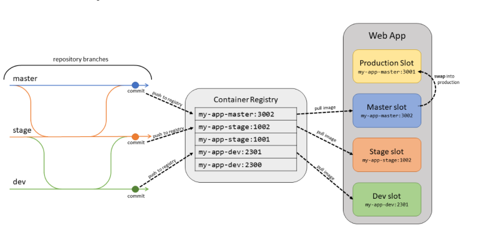
## Setup 

### Fork repo. 
First step is to fork the original repo. The actions workflow will be deployed to this new repo 
 - Go to ``https://github.com/MicrosoftDocs/mslearn-deploy-run-container-app-service``
 - Click for repo in the top right hand corner 
 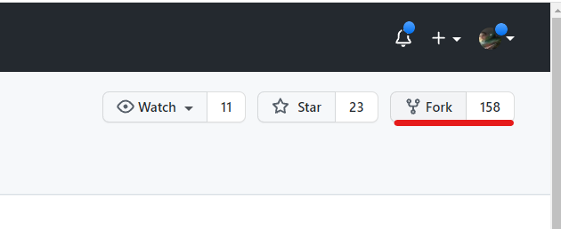
 - Clicking should show a forking status 
 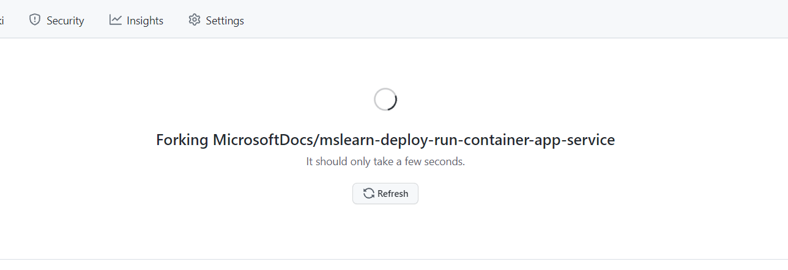

Next step is to configure our webapp to perform continuous deployment based on our forked repo
 
## Configure github continuous deployment 
 Once the fork is complete we are now going to link Azrue App services to Github. This will configure a github workflow to build and deploy to Azure Webapps 
 - Go to Azure portal and navigate to the App Service. This can be done by the search box in the top of the portal or selecting 'App Services' in the Left hand menu
- Select the App service and navigate to the ``Deployment Center``
- Select ``Github Actions Build``
- Sign into your github in the 'Github Actions' Section
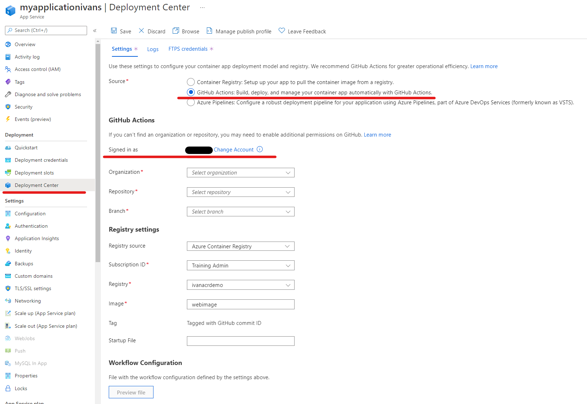
- You will be prompted to sign into github 
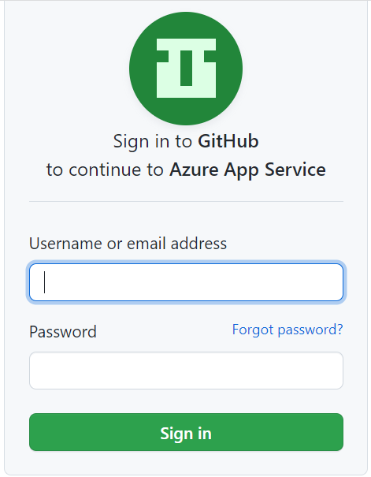
- Once signed into Github account  select the organisation, repository and branch the continous deployment should be based upon 
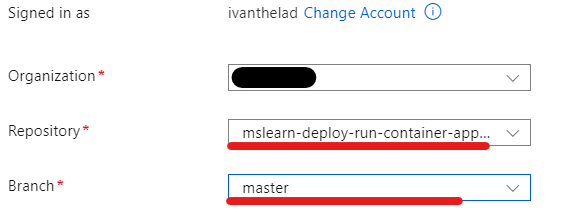
-  you are prompt to select the Azure Container registry and the name the image will be pushed under 
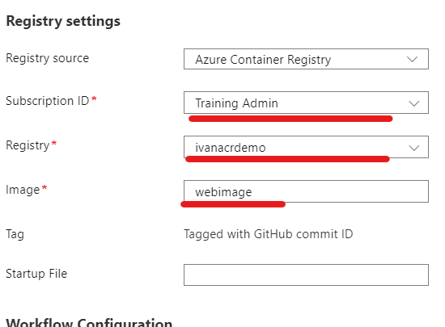
-  Leave the Startup file emptry 
- You can view the generate Github workflow by clicking "Preview File"
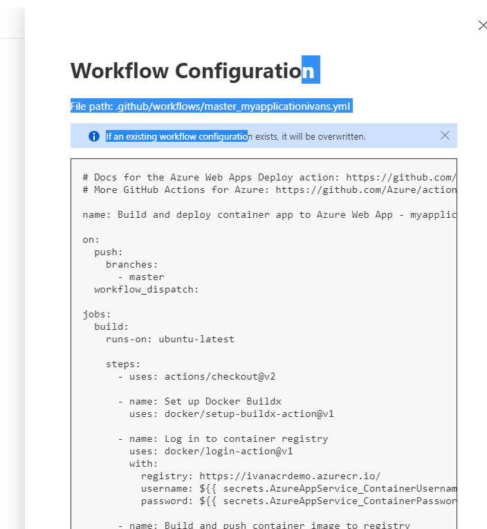
- Click  Save: will setup the workflow in the github repo. 

## Modify the default Work flow to point to a docker file.
The default workflow expects a Dockerfile under the root directory. In the repository there is no dockerfile under root and this result is the initial build will fail. To fix this we need to modify the workflow. 
 - Edit the workflow file directly in the browser. 
 - Browse to the project github repository under ``mslearn-deploy-run-container-app-service/.github/workflows`` and click ``Edit`
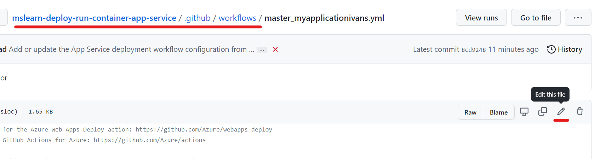 

 - Fine the Action  ``Build and push container image to registry`` (line:29) Before change
 ```
    - name: Build and push container image to registry
      uses: docker/build-push-action@v2
      with:
        push: true
        tags: ivanacrdemo.azurecr.io/${{ secrets.AzureAppService_ContainerUsername_7952d75685264c64bf830e10954dbd0d }}/webimage:${{ github.sha }}
        file: ./Dockerfile
```
 - Modify the action entry by adding a parameter/value ``context: dotnet``
 - Remove the entry ``file: ./Dockerfile``. this is not needed as it will default to looking for a dockerfile under the ``context`` directory
 - The action should now look like this.  
```
    - name: Build and push container image to registry
      uses: docker/build-push-action@v2
      with:
        push: true
        context: dotnet
        tags: ivanacrdemo.azurecr.io/${{ secrets.AzureAppService_ContainerUsername_7952d75685264c64bf830e10954dbd0d }}/webimage:${{ github.sha }}

```
 - Commit changes in the portal
 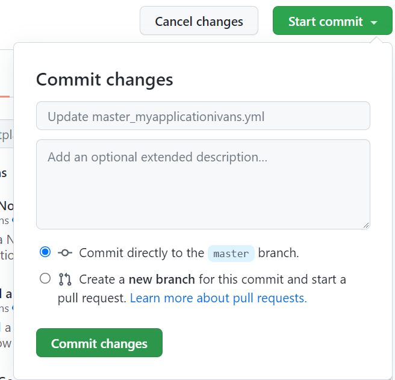 
 -  To view if the build is succesful. In github under the project navigate to Actions and the the build, push and deployment should be succesful   
 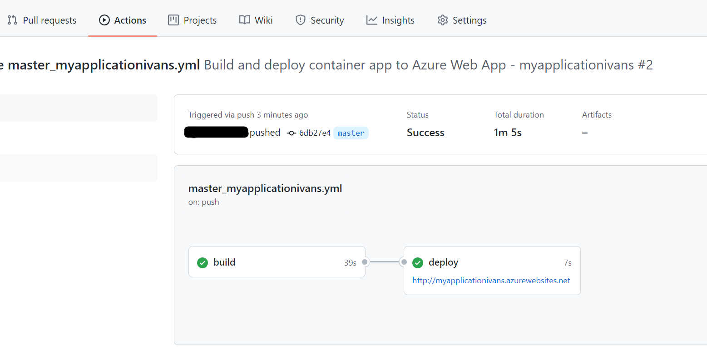 

## Trigger a build 
Now we want to see if our build pipeline really results in our application been redeployed and updated 
- In the project repo.  Modify the html file ``mslearn-deploy-run-container-app-service/dotnet/SampleWeb/Pages/Index.cshtml``. For the sake of simplicity perform these changes in the github UI
- Simply change the text in   ``  <h1 class="display-4">Welcome</h1> `` to something else. 
- Update file by committing and push change in the github UI. 
- Once the workflow is complete open the application URL(can be found in the AppService overview in the portal)
- Confirm changes have been deployed 


## Conculsion 
We were able to configure a continuous build and deployment pipeline via Azure Webapps default wizard  


## Reference 
- Patterns container : https://docs.microsoft.com/en-us/azure/app-service/deploy-best-practices#continuously-deploy-containers 
- Github Actions: https://docs.microsoft.com/en-us/azure/app-service/deploy-best-practices#use-github-actions
- Web app Deployment  https://docs.microsoft.com/en-us/azure/app-service/deploy-ci-cd-custom-container?tabs=acr&pivots=container-linux
 - https://docs.github.com/en/actions/deployment/deploying-to-azure-app-service
