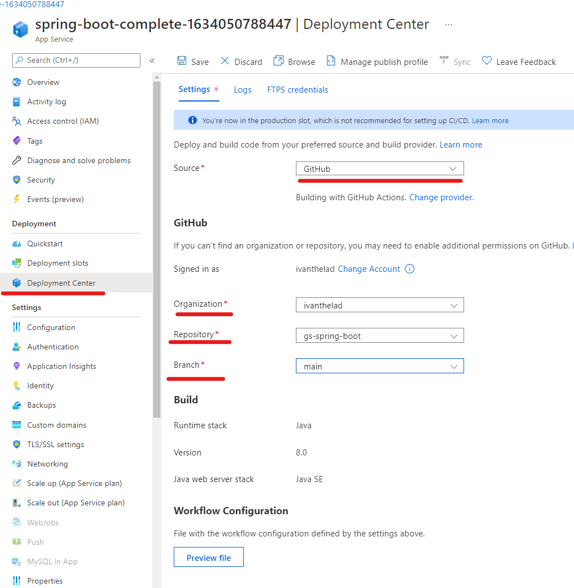

# Deploy java application to 
Azure App Service provides a highly scalable, self-patching web hosting service. This lab shows how to use the Azure CLI with the Azure Web App Plugin for Maven to deploy a .jar file, or .war file. Use the tabs to switch between Java SE and Tomcat instructions.

## 1 Clone project 
Clone the Spring Boot Getting Started sample project.
```
git clone https://github.com/spring-guides/gs-spring-boot
```
## 2 Prepare maven project
Run the Maven command below to configure the deployment. This command will help you to set up the App Service operating system, Java version, and Tomcat version.

- first navigate to the project folder 
```
cd gs-spring-boot/complete
```
- Execute the following command. This will start a wizard to configure the maven plugin automatically. 
```
mvn com.microsoft.azure:azure-webapp-maven-plugin:2.2.0:config
```
- When prompted with Subscription option, select the proper Subscription by entering the number printed at the line start.
- When prompted with Web App option, select the default option, <create>, by pressing enter.
- When prompted with OS option, select Linux by pressing enter.
- When prompted with javaVersion option, select Java 8 by entering 1.
- When prompted with Pricing Tier option, select P1v2 by entering 9.
- Finally, press enter on the last prompt to confirm your selections.
- You can modify the pom file directly by modifying the following properties in that are injected into the pom file 

 | Property | 	Required | 	Description | 	Version | 
 | -------- | ------------  | ---------  | ------------- | 
 | schemaVersion | false | 	Specify the version of the configuration schema. Supported values are: v1, v2. | 	1.5.2 | 
 | subscriptionId | false | Specify the subscription ID. | 	0.1.0+ | 
 | resourceGroup |  	true | 	Azure Resource Group for your Web App. | 	0.1.0+ | 
 | appName | 	true | 	The name of your Web App. | 	0.1.0+ | 
 | region | 	false | 	Specifies the region where your Web App will be hosted; the default value is centralus. All valid regions at Supported Regions section. | 	0.1.0+ | 
 | pricingTier | false | 	The pricing tier for your Web App. The default value is P1v2 for production workload, while B2 is the recommended minimum for Java dev/test. Learn more | 	0.1.0+ | 
 | runtime | false | 	The runtime environment configuration, you could see the detail here. | 	0.1.0+ | 
 | deployment | 	false | 	The deployment configuration, you could see the details here. | 	0.1.0+
You can modify the configurations for App Service directly in your pom.xml if needed. Some common ones are listed below: | 
### Inspect pom.xml
To view the changes the maven plugin made. Open the pom.xml under gs-spring-boot/complete/pom-xml  ``code pom.xml ``. and under the build section
```
      <plugin>
        <groupId>com.microsoft.azure</groupId>
        <artifactId>azure-webapp-maven-plugin</artifactId>
        <version>2.2.0</version>
        <configuration>
          <schemaVersion>v2</schemaVersion>
          <subscriptionId>yxxxxxx</subscriptionId>
          <resourceGroup>spring-boot-complete-xxxx-rg</resourceGroup>
          <appName>spring-boot-complete-xxxxx</appName>
          <pricingTier>P1v2</pricingTier>
          <region>centralus</region>
          <runtime>
            <os>Linux</os>
            <javaVersion>Java 8</javaVersion>
            <webContainer>Java SE</webContainer>
          </runtime>
          <deployment>
            <resources>
              <resource>
                <directory>${project.basedir}/target</directory>
                <includes>
                  <include>*.jar</include>
                </includes>
              </resource>
            </resources>
          </deployment>
        </configuration>
      </plugin>
```

## 3 Deploy java to cloud 
With all the configuration ready in your pom file, you can deploy your Java app to Azure with one single command.
```
mvn package azure-webapp:deploy
```
Navigate to the azure portal and open the open the application url to verify the deployment was successful. 
### Deploy application with zip deploy 
Another approach to test is simply deploying the .jar file. https://docs.microsoft.com/en-us/azure/app-service/deploy-zip?tabs=cli#deploy-a-zip-package
```
az webapp deploy --resource-group spring-boot-complete-1634050788447-rg --name spring-boot-complete-1634050788447  --src-path  spring-boot-complete-0.0.1-SNAPSHOT.jar --type jar
```

## 4 Extra: Set up continuous deployment for java 
Simialr to previous lab  we can configure Continous deployment via the "deploymen center" 
https://docs.microsoft.com/en-us/azure/app-service/deploy-continuous-deployment?tabs=github

Hints 
 - in github fork the repo 
 - Go to "deployment center" and configure your github as source repo
  
 - you may need to make changes to the generate to work flow file .yaml file to ensure
    * the mvn package script is executed in the correct folder 
    * the .jar artifact is copyed to the next stage 
```

      - name: Build with Maven
        run: mvn clean install
        working-directory: '${{ github.workspace }}/complete'
      
    
      - name: Upload artifact for deployment job
        uses: actions/upload-artifact@v2
        with:
          name: java-app
          path: '${{ github.workspace }}/complete/target/*.jar'
```


https://docs.microsoft.com/en-us/azure/app-service/deploy-continuous-deployment?tabs=github


