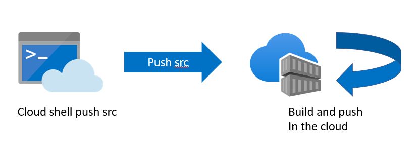
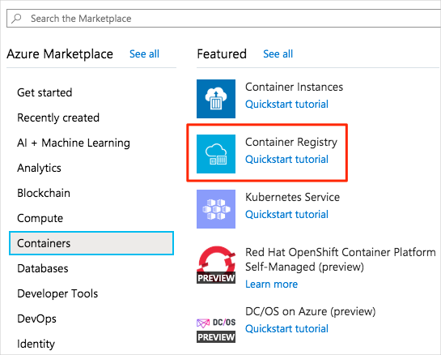
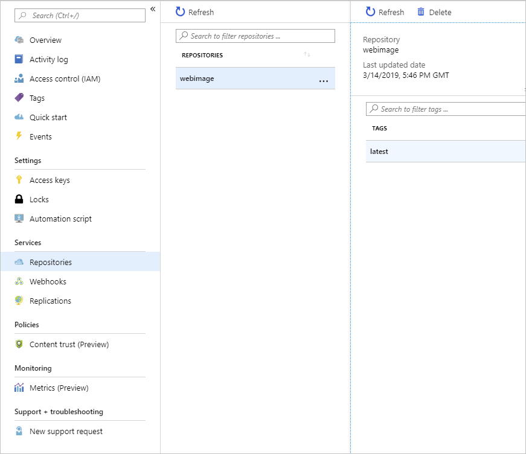

# Create ACR 
Azure Container Registry provides storage for Docker images in the cloud.


In the example scenario, the team needs to create a registry to store the images for their web apps.
In this unit, you'll use the Azure portal to create a new registry in Container Registry. You'll build a Docker image from the source code for a web app and upload it to a repository in your registry. Finally, you'll examine the contents of the registry and the repository.
 
## Create with CLI 
```
resourceGroup="ivanresourcegroup"
acr="ivanacrdemo"
az group create --location westeurope --name $resourceGroup 

az acr create --name $acr --resource-group $resourceGroup --sku standard --admin-enabled true
```

## Create  ACR in portal 
 - Sign in to the Azure portal with your Azure subscription.
 - On the Azure portal home page, under Azure services, select Create a resource. The Create a resource pane appears.
 - In the left menu pane, select Containers, and under Popular products, select Container Registry.
   
 - On the Basics tab, enter the following values for each setting.

| Name  | Description |
| ------------- | ------------- |
| Subscription  | Select your Azure subscription.  |
| REsource Group  | Select Create new, and enter learn-deploy-container-acr-rg, and select OK. This approach may make it easier to clean up these resources when you're finished with the module. If you choose a different resource group name, make note of it for the rest of the exercises in this module.  |
| Registry name  | Enter a unique name and make a note of it for later.  |
| SKU  | standar |

## Build app 
Open cloud shell. in these steps we are going to make ACR build our application, run the following command to download the source code for the sample web app. This web app is simple. It presents a single page that contains static text, and a carousel control that rotates through a series of images.
-  checkout source code 
```
git clone https://github.com/MicrosoftDocs/mslearn-deploy-run-container-app-service.git
```
- Change directory to project 
``` 
cd mslearn-deploy-run-container-app-service/dotnet
```
- Execute the following command. This command sends the folder's contents to Container Registry, which uses the instructions in the Docker file to build the image and store it. Take care not to leave out the . character at the end of the command.
``` 
az acr build --registry $acr --image webimage:v1 .
``` 
## Examine the container registry
- Return to the Azure portal, and on the Overview page for your container registry, select Go to resource. Your Container registry pane appears.
- In the left menu pane, under Services, select Repositories. The Repositories pane appears for your container registry. You'll see a repository named webimage.
- Select the webimage repository. The webimage repository pane appears. It contains an image with the latest tag. This is the Docker image for the sample web app.
 -  

## Summary 
in the lab you successfully built and pushed and image to Azure Container Registry 


