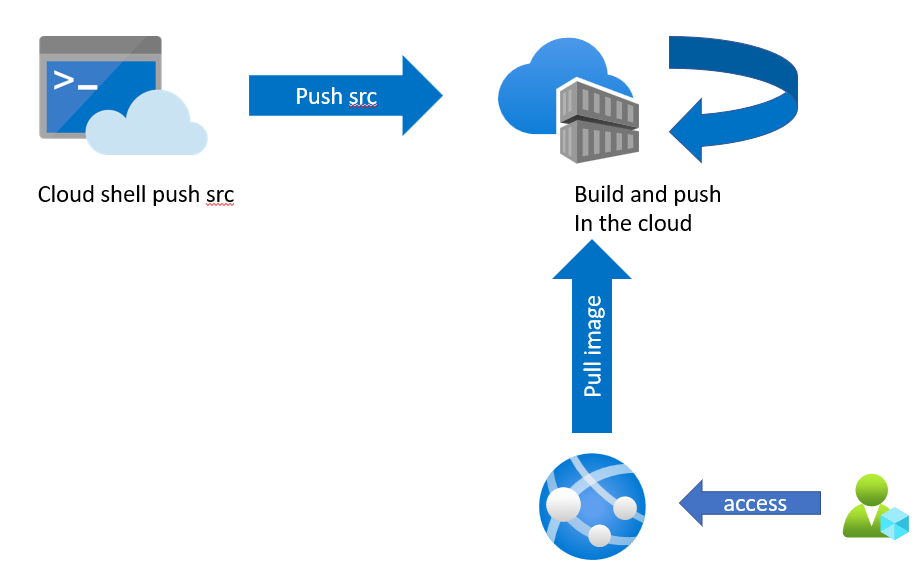
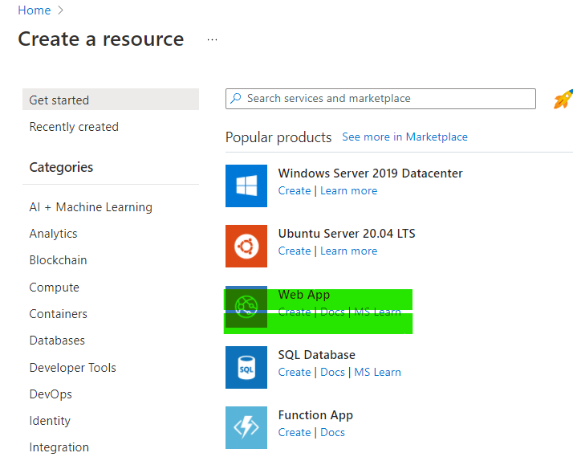
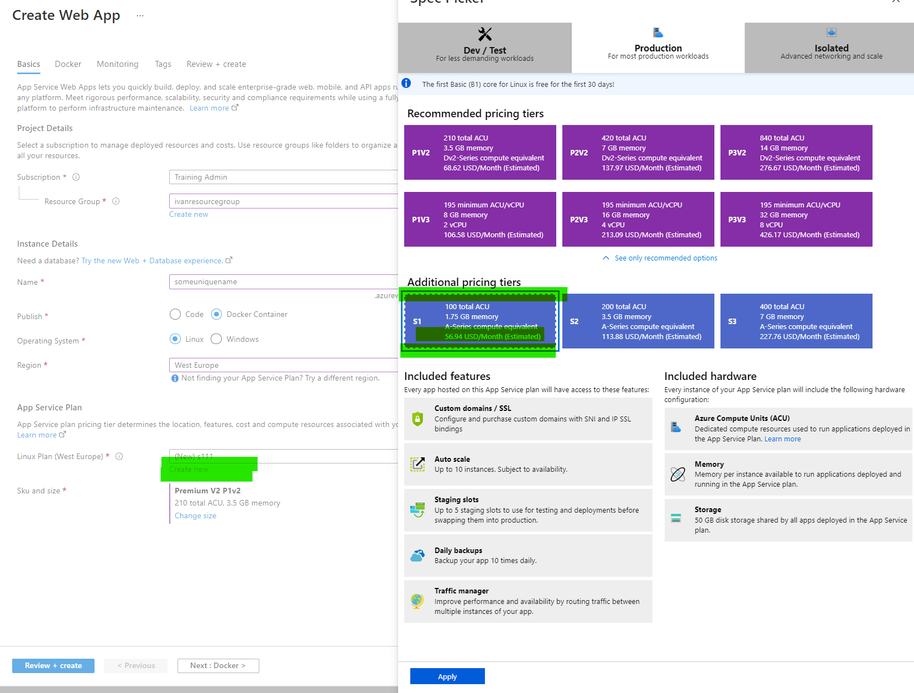
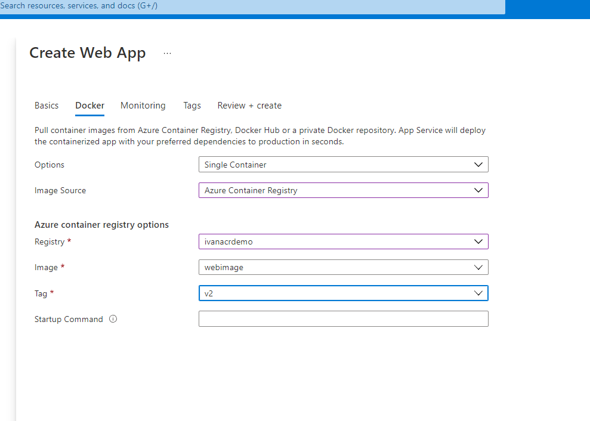

# Deploy a web app by using an image from an Azure Container Registry repository
You can deploy a web app to Azure App Service directly from Azure Container Registry.

In the example scenario, the team wants to host the web app in App Service. They need to configure App Service to retrieve the image for the web app from the repository in Container Registry.

In this section , you'll learn how you can configure App Service to deploy a web app from a repository in Container Registry.
 
## (Option 1) Create and deploy a webapp in the portal 
In the example scenario, you have uploaded the image for the web app to Azure Container Registry and is now ready to deploy the web app.
- In  Azure portal home page, and under Azure services, select Create a resource. The Create a resource pane appears.
- Search for "Web App" or on the left  select Web, and under Popular offers, select Web App.
  
- On the Basics tab, enter the following values for each setting.

| Setting   | value |
| ------------- | ------------- |
| Subscription | Select your default Azure subscription in which you are allowed to create and manage resources. | 
| Resource Group | From the dropdown list, select the existing resource group learn-deploy-container-acr-rg. | 
| Name |  Enter a unique name and make a note of it for later.| 
| Publish |  Docker Container | 
| Operating System | Linux | 
| Region |  Select the same location that is close to you from previous exercise. | 
| App Service plan | S1. (We use S1 to make use of slots). You will need to create a new service plan | 
  
- Select Next: Docker >.
- On the Docker tab, enter the following values for each setting.
| Setting   | value |
| ------------- | ------------- |
|Options|	Single Container|
|Image Source	|Azure Container Registry|
|Registry|	Select your registry.|
|Image|	webimage|
|Tag|	latest |
|Startup Command |Leave this setting empty.|
- 
- Select Review and create, and then select Create. Wait until the web app has been deployed before you continue.
- To test the app, browse to https://<app-name>.azurewebsites.net, replacing <app-name> with the name of your web app. On first access, it may take some time for the app to respond because App Service must pull the entire image from the registry. If the browser times out, just refresh the page. Once the initial image is pulled, subsequent tests will run much faster.

## (Option 2) Create and deploy a webapp in the Cloud Shell  

To deploy a container to Azure App Service, you first create a web app on App Service, then connect the web app to the container registry. When the web app starts, App Service automatically pulls the image from the registry.
- Configure the following parameters in your cloud shell 
```
resourceGroup="ivanresourcegroup"
appserviceplan="ivanappservice"
appname="myapplicationivans" ## This should be unique
appname="nynynynsg1" ## This should be unique

az group create --location westeurope --name $resourceGroup
```
- Create an App Service plan using the az appservice plan create command: Creates an App Service plan
```
az appservice plan create --name $appserviceplan --resource-group $resourceGroup --is-linux --sku S1
```
- Create the web app with the az webpp create command: 	Creates an App Service app.
```
 az webapp create --resource-group $resourceGroup --plan $appserviceplan  --name $appname --deployment-container-image-name ivanacrdemo.azurecr.io/webimage:v1 
```
- To test the app, browse to https://<app-name>.azurewebsites.net, replacing <app-name> with the name of your web app. On first access, it may take some time for the app to respond because App Service must pull the entire image from the registry. If the browser times out, just refresh the page. Once the initial image is pulled, subsequent tests will run much faster.

-  -  

## Resources 
https://docs.microsoft.com/en-us/azure/app-service/samples-cli