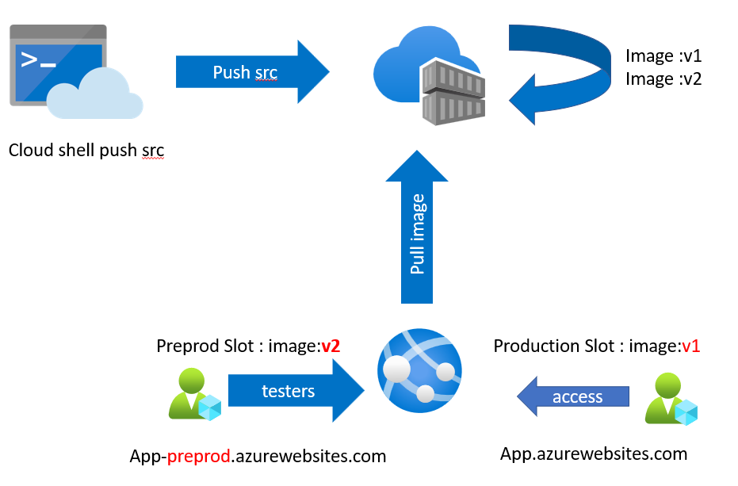
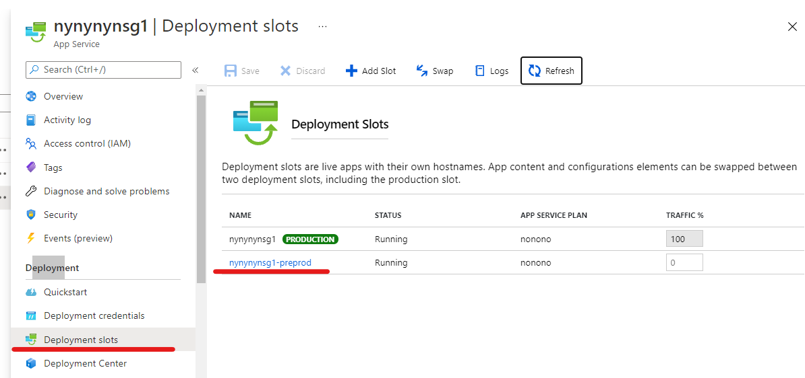
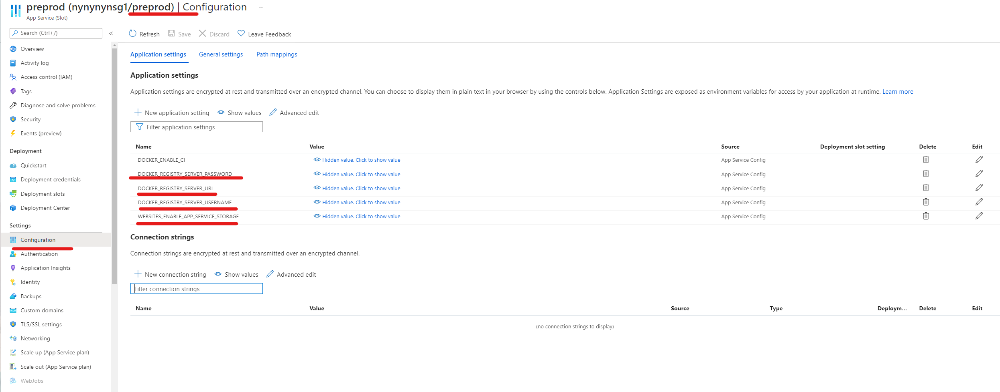
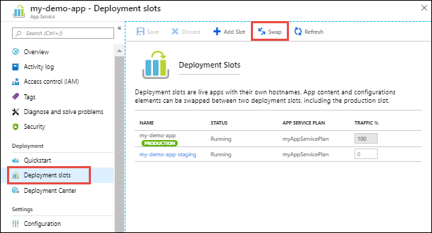
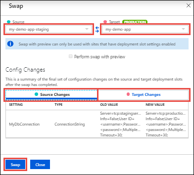
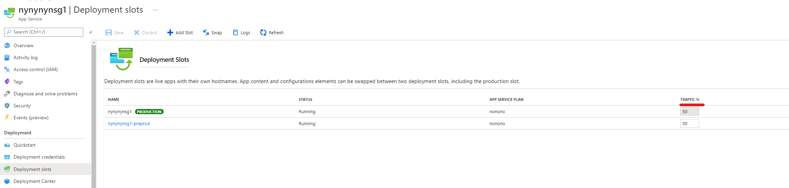

## Deployment slots 

Deployment slots are live apps with their own hostnames. App content and configurations elements can be swapped between two deployment slots, including the production slot.
Using separate staging and production slots has several advantages.

- You can validate app changes in a staging deployment slot before swapping it with the production slot.
- Deploying an app to a slot first and swapping it into production ensures that all instances of the slot are warmed up before being swapped into production. This eliminates downtime when you deploy your app. The traffic redirection is seamless, and no requests are dropped because of swap operations. This entire workflow can be automated by configuring Auto Swap when pre-swap validation is not needed.
- After a swap, the slot with previously staged app now has the previous production app. If the changes swapped into the production slot are not as you expected, you can perform the same swap immediately to get your “last known good site” back.- 

For the new web app, you created only one slot: the production slot. You deployed source code to this slot.

Next, you'll create a deployment slot where you can stage new versions of the web app. Whenever possible, use deployment slots when deploying a new production build. When using a Standard App Service Plan tier or better, you can deploy your app to a staging environment, validate your changes, and do smoke tests. When you are ready, you can swap your staging and production slots. The swap operation warms up the necessary worker instances to match your production scale, thus eliminating downtime.
 
## 1 Modify and rebuild application  for Deployment slot 
Before we configure any slots we create the application for the slot. For this we will simply modify the landing page. For this we will rebuilt our docker image under a new tag 

### Modify application and push to ACR

- Navigate to the project from the [Lab 2 - Deploy and run containers in Azure Webapps ](webappdeploy.md)
- Set variables 
```
resourceGroup="ivanresourcegroup"
## This should be unique
appname="myapplicationivans" 
## This should be unique
acr="ivanacrdemo"
```
- Chnage directory to application project 
``` 
cd mslearn-deploy-run-container-app-service/dotnet/SampleWeb/Pages
```
- Create the modified index pages by overwriting the previous one 
```
cp Index.cshtml.new  Index.cshtml
```
- Navigate back to the Application root folder. this is the folder where the Dockerfile can be found(mslearn-deploy-run-container-app-service/dotnet/)  
```
cd ../../
```
- Execute the following command. This command sends the folder's contents to Container Registry, which uses the instructions in the Docker file to build the image and store it. Take care not to leave out the . character at the end of the command.
``` 
az acr build --registry $acr --image webimage:v2 .
```  

## 2 Create a Preprod Slot 
### (option a) Create a new Preproduction Slot with CLI 
```
## Set variables 
resourceGroup="ivanresourcegroup"
appname="myapplicationivans" ## This should be unique
az webapp deployment slot  create  -s preprod --name $appname -g $resourceGroup
```
### (option b)Create a new Preproduction Slot in the Portal 
Create a new staging slot
- On the Azure portal menu, or from the Home page, select All resources, filter by Type == App Service, and then select Apply.
- Select your web app. The App Service pane appears for your web app.
- In the left menu pane, under Deployment, select Deployment slots. The Deployment slots pane appears for your App Service
- 
- From the top menu bar, select Add Slot. The Add a slot pane appears.
- In the Name field, enter Staging, accept the default for Clone settings from, and then select Add.
- After the deployment slot is successfully created, select Close.

### View Slot 


##  3 Configure the container to use the new image 

### option 1: Configure new image in the portal CLI
The following commans sets the Docker container for the App Service app.
```
az webapp config container set -s preprod --docker-custom-image-name $acr.azurecr.io/webimage:v2 -g $resourceGroup --name $appname  --docker-registry-server-url  https://$acr.azurecr.io
```

### option 2: Configure the Container in Portal 
You can also configure the new slot to use the new image by 
 -  Go to Deployments slots and select click into the new slot
 - This essentially navigates into a copy of your webapp. here you can configure the "preprod" slot with different configurations. 
 - To configure a different image. inside the slot select "Configuration"->Application Settings
 - Modify the following configuration 
 -   DOCKER_REGISTRY_SERVER_PASSWORD
 -   DOCKER_REGISTRY_SERVER_URL
 -   DOCKER_REGISTRY_SERVER_USERNAME
 
 -
### View new deployment 
As an extra task. Navigate to the new deploy slot to test if the application deployment has taken place. Find the url of the application  


## 4 Switch slots. Promoting staging to Production  
You can swap deployment slots on your app's Deployment slots page and the Overview page. For technical details on the slot swap, see What happens during swap.
 - Go to your app's Deployment slots page and select Swap.
 - The Swap dialog box shows settings in the selected source and target slots that will be changed.
 -  
 - Select the desired Source and Target slots. Usually, the target is the production slot. Also, select the Source Changes and Target Changes tabs and verify that the configuration changes are expected. When you're finished, you can swap the slots immediately by selecting Swap.
swapbuttonbar
-  -  

## 5 Canary routing 
 By default, all client requests to the app's production URL (http://<app_name>.azurewebsites.net) are routed to the production slot. You can route a portion of the traffic to another slot.  This feature is often know as canary deployment is useful if you need user feedback for a new update, but you're not ready to release it to production.

 To route production traffic automatically:
- Go to your app's resource page and select Deployment slots.
- In the Traffic % column of the slot you want to route to, specify a percentage (between 0 and 100) to represent the amount of total traffic you want to route. Select Save.
- In a new browser widow (icognito) browse to the application URL

 
## Reference 
 -  Staging : https://docs.microsoft.com/en-us/azure/app-service/scripts/cli-deploy-staging-environment?toc=/cli/azure/toc.json
 -  Setting image_: https://docs.microsoft.com/en-us/azure/app-service/scripts/cli-linux-docker-aspnetcore?toc=/cli/azure/toc.json


